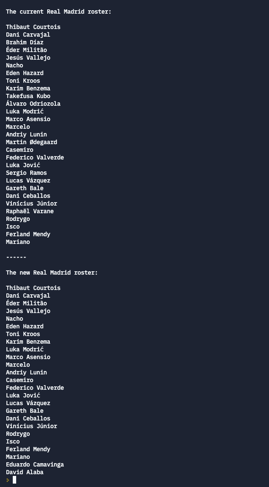

# Roster Change: Instructions

There’s been some changes to the roster for Real Madrid. Write a program that makes the changes to the list and shows the difference between the old and new rosters.

## Your Task

In the starter code, there is a list with the current players on the roster. The fans want to see the roster before and after the changes, so be sure you don't change the values in the array before you print it out.

1. Print out the names of the players using a `for` loop
2. Use `pop()` to remove players from the roster. The players the team is dropping are:

- Martin Ødegaard	
- Raphaël Varane	
- Brahim Díaz
- Sergio Ramos
- Takefusa Kubo
- Álvaro Odriozola

In the roster list, they have indices 2, 9, 10, 15, 19, and 24.

3. Use `append()` to add players to the roster. The players the team is adding are:

- Eduardo Camavinga
- David Alaba

4. Print out the new roster.

## Rubric

Run the tests to verify that your program is correct. It should print out the old roster, then the new roster.

You should also run your code and see for yourself that the program works. The tests can help check your work, but they aren't perfect.

## Expected Results

Here's a screenshot of a successful run of the program:

## Hints

When using `pop` to remove players, the list changes. That means that the index in the list for each player will change. Be careful to remove the right players!

Avoid trying to type the names of the players. Many of the names have special characters that are difficult to type on the keyboard. Instead, copy and paste the names.

## Credits

* Squad list from https://en.wikipedia.org/wiki/Real_Madrid_CF#Current_squad
* Recent Transfers from https://www.transfermarkt.us/real-madrid/alletransfers/verein/418